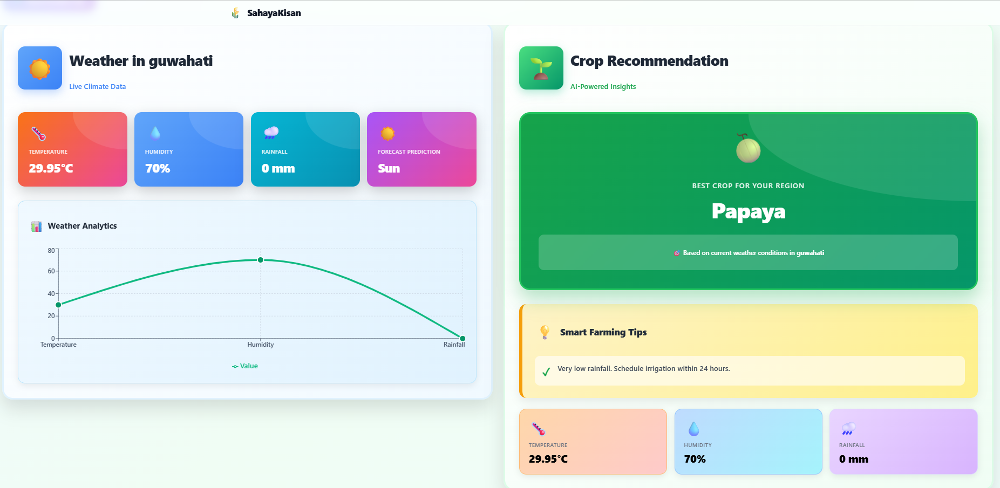

# 🌾 Krishi Sakhi - AI-Powered Crop Recommendation & Weather Prediction Dashboard

A complete farmer dashboard with ML-powered crop recommendations and weather predictions. Built with FastAPI, React, and TensorFlow.

<p align="center">
   
   <br/>
   
</p>
## 🌾 Project Structure

```
├── backend/          # FastAPI backend
│   ├── main.py      # API endpoints with ML predictions
│   ├── requirements.txt
│   ├── .env         # API keys (OpenWeather)
│   └── models/      # ML models (.h5 and .pkl files)
├── frontend/        # React + Vite frontend
│   └── src/
│       ├── components/
│       │   ├── Dashboard.jsx     # Main dashboard with soil form
│       │   ├── Dashboard.css     # Dashboard styling
│       │   ├── WeatherCard.jsx   # Weather display with charts
│       │   ├── WeatherCard.css   # Weather card styling
│       │   ├── CropCard.jsx      # Crop recommendation display
│       │   ├── CropCard.css      # Crop card styling
│       │   ├── Sidebar.jsx       # Navigation sidebar
│       │   └── Sidebar.css       # Sidebar styling
│       ├── api.jsx              # Axios API client
│       ├── App.jsx              # Main app component
│       └── index.css            # Global styles
├── Training/        # Jupyter notebooks for model training
└── models/          # Trained ML models
```

## 🚀 Setup Instructions

### Backend Setup

1. **Activate your conda environment:**

   ```bash
   conda activate potato_disease
   ```

2. **Navigate to backend and install dependencies:**

   ```bash
   cd backend
   pip install -r requirements.txt
   ```

3. **Set up environment variables:**

   Create a `.env` file in the `backend/` directory:

   ```bash
   OPENWEATHER_API_KEY=your_api_key_here
   ```

   Get a free API key from: https://openweathermap.org/api

4. **Ensure models are in the correct location:**
   - Models should be in: `../models/` (relative to backend/)
   - Required files:
     - `crop_recommendation_model.h5`
     - `weather_prediction.h5`
     - `scaler.pkl` (optional, for weather model)

5. **Start the backend server:**
   ```bash
   uvicorn main:app --reload
   ```
   Backend will run on: `http://127.0.0.1:8000`

### Frontend Setup

1. **Navigate to frontend:**

   ```bash
   cd frontend
   ```

2. **Install dependencies:**

   ```bash
   npm install
   ```

3. **Start the development server:**
   ```bash
   npm run dev9):** Nitrogen (N), Phosphorus (P), Potassium (K), Temperature, Humidity, pH, Rainfall, Soil Type (encoded), Padding
   ```

- **Output:** Recommended crop (31 classes)
- **Crops Supported:**
  - Legumes: Adzuki Beans, Black gram, Chickpea, Ground Nut, Kidney Beans, Lentil, Moth Beans, Mung Bean, Peas, Pigeon Peas
  - Cash Crops: Coconut, Coffee, Cotton, Jute, Rubber, Sugarcane, Tea, Tobacco
  - Fruits: apple, banana, grapes, mango, muskmelon, orange, papaya, pomegranate, watermelon
  - Grains: maize, millet, rice, wheat
- **Soil Types Supported:** Loamy, Sandy, Clayey, Silty, Peaty
- **Architecture:** TensorFlow/Keras Sequential Neural Network
- **Dataset:** Kaggle Crop Recommendation Dataset

### Weather Prediction Model

- **Input Features (5):** Precipitation, Max Temperature, Min Temperature, Wind Speed, Month
- **Output:** Weather type (5 classes: drizzle, fog, rain, snow, sun)
- **Architecture:** TensorFlow/Keras Sequential Neural Network with StandardScaler
- **Dataset:** Kaggle Weather Prediction Dataset
- **Dataset:** [Kaggle Crop Recommendation](https://www.kaggle.com/datasets/nishchalchandel/crop-recommendation)

### Weather Prediction Model

- **Input Features (5):** precipitation, temp_max, temp_min, wind, month
- **Output:** Weather type (drizzle, fReal-time weather data using OpenWeather API
- 🌾 **Smart Crop Recommendations:** ML-based suggestions for 31 different crops
- 🌱 **Soil Data Collection:** Two-step form collects location and soil parameters (N, P, K, pH, soil type)
- 🌤️ **Weather Predictions:** 5-class weather forecasting (drizzle, fog, rain, snow, sun)
- 📊 **Interactive Charts:** Visual weather analytics with Recharts
- 💡 **Smart Farming Tips:** Context-aware suggestions based on weather and soil conditions
- 🎨 **Beautiful UI:** Professional farmer-themed design with custom CSS
- 📱 **Responsive Design:** Mobile, tablet, and desktop optimized
- 🌐 **Multi-language Ready:** UI prepared for English, Hindi, Marathi
- ⚡ **Fast & Modern:** React 18 + Vite for lightning-fast development
- 🌍 **City-based Weather Fetching:** Uses OpenWeather API
- 🌾 **Smart Crop Recommendations:** ML-based suggestions
- 🌤️ **Weather Predictions:** 5-class weather forecasting
- 📊 **Interactive Charts:** Visual data representation
- 💡 **Farming Tips:** Context-aware suggestions
- 🎨 **Beautiful UI:** Farmer-themed green design

## 🔑 API Key

The OpenWeather API key is stored in `backend/.env`. To use your own key:

1. Get a free API key from: https://openweathermap.org/api
2. Update `backend/.env`:
   ```
   OPENWEATHER_API_KEY=your_api_key_here
   ```

## 🐛 Troubleshooting

### Models Not Found

If you see "FileNotFoundError: models/...", make sure:

- Models are in `backend/models/` directory
- You're running `uvicorn` from the `backend/` folder

### Port Already in Use

If port 8000 or 5173 is busy:

```bash
# For backend, use different port:
uvicorn main:app --reload --port 8001

# Fo� How It Works

1. **User enters city name** → System fetches real-time weather data from OpenWeather API
2. **User provides soil information** → Form collects Nitrogen, Phosphorus, Potassium, pH, and soil type
3. **Weather Prediction** → ML model predicts weather type based on current conditions
4. **Crop Recommendation** → ML model recommends best crop based on weather + soil data
5. **Smart Tips** → System generates farming tips based on predictions and soil analysis

## 📝 Important Notes

- **Soil Data Required:** The crop model requires actual soil nutrient values for accurate predictions. Default values (N=40, P=60, K=40, pH=6.5, Loamy soil) are provided but should be replaced with real measurements.
- **Scaler Missing:** The crop model was trained with scaled data, but the scaler wasn't saved. Using raw values may affect accuracy. Consider retraining with a saved scaler for best results.
- **Class Order:** Ensure the crop class order in `CROP_CLASSES` matches your training label encoder exactly.
- **Weather Data:** Weather predictions work best for locations with diverse weather patterns and sufficient historical data.

## 🎯 Future Improvements

- ✅ ~~Add soil data collection form~~ (Completed)
- ✅ ~~Separate component styling into CSS files~~ (Completed)
- 🔲 Add soil sensor integration for automatic NPK readings
- 🔲 Include historical weather data and trends
- 🔲 Implement multi-language support backend (UI ready)
- 🔲 Add user authentication and profile management
- 🔲 Save farmer preferences and prediction history
- 🔲 Export recommendations as PDF
- 🔲 Add crop calendar and planting schedules
- 🔲 Integrate market price predictions

## 🤝 Contributing

Contributions are welcome! Please ensure:
- Backend code follows PEP 8 style guidelines
- Frontend code uses ESLint formatting
- All new features include appropriate error handling
- Update documentation for new features

## 📄 License

This project is for educational purposes. Please respect the licenses of datasets used for training.

---

**Built with ❤️ for farmers by leveraging AI and modern web technologies**for N, P, K, pH, and Soil since these aren't provided by weather APIs
- For better accuracy, consider collecting soil data separately
- Weather predictions work best for locations with diverse weather patterns

## 🎯 Future Improvements

- Add soil sensor integration for NPK values
- Include historical weather data
- Add multi-language support
- Implement user authentication
- Save farmer preferences and history

Enjoy farming smarter! 🚜🌾
```
